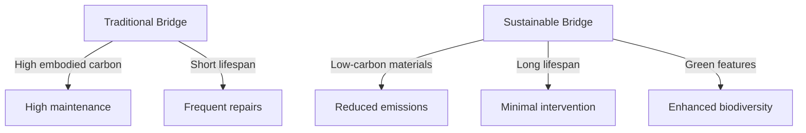

# Bridging the Future: Top Trends and Innovations in Bridge Construction for 2026

## Introduce the State of Bridge Construction in 2026

The bridge construction landscape in 2026 is defined by urgency, innovation, and a renewed commitment to sustainability. As global economies demand faster, smarter, and greener infrastructure, bridges have become critical arteries for connectivity, trade, and resilience. The American Road & Transportation Builders Association (ARTBA) projects strong growth in bridge construction for 2026, driven by federal initiatives and a backlog of aging structures in dire need of modernization ([Bridge Construction Expected to be Strong in 2026, Says ARTBA](https://www.shortspansteelbridges.org/bridge-construction-expected-to-be-strong-in-2026-says-artba/)). This momentum reflects a broader global push for infrastructure renewal—one where bridges are not just functional links, but symbols of progress and environmental stewardship.

Decades of deferred maintenance have left thousands of bridges structurally deficient, with over 40% of U.S. bridges older than their intended lifespan ([Billion-dollar bridge projects will launch in 2026 as officials tackle decades of deferred maintenance](https://www.spartnerships.com/us-bridge-replacement-projects/)). The cost of inaction is staggering—congestion, safety risks, and economic stagnation. In response, federal funding has surged, accelerating project pipelines and enabling states to prioritize high-impact replacements. These investments are not merely repairs; they are reimaginings of how bridges can serve communities while minimizing environmental impact.

Sustainability is now at the heart of bridge design. Engineers are turning to carbon-neutral materials, recycled composites, and low-carbon concrete alternatives to reduce embodied emissions by up to 50% ([Carbon-Neutral Concrete Bridge Shows New Direction for Structural Materials](https://materialdistrict.com/article/carbon-neutral-concrete-bridge-shows-new-direction-for-structural-materials/)). Resilience is equally critical—designs now incorporate climate-adaptive features to withstand extreme weather, flooding, and seismic activity. The 2026 World Bridge Engineering Conference at Florida International University underscores this shift, bringing together global experts to share breakthroughs in adaptive infrastructure ([2026 World Bridge Engineering Conference - ABC-UTC - FIU](https://abc-utc.fiu.edu/conference/)).

Innovation is reshaping every phase of bridge construction. Digital tools like Bentley’s OpenBridge Designer are enabling real-time collaboration and lifecycle analysis, while AI-driven inspection systems reduce downtime and improve safety ([OpenBridge Designer: Bridge Design Software | Bentley Systems](https://www.bentley.com/software/openbridge-designer/)). From self-healing concrete to modular construction techniques, the industry is embracing solutions that are faster, safer, and more sustainable than ever before.

As we look toward 2026 and beyond, bridges are no longer just static structures—they are dynamic assets designed for longevity, equity, and ecological harmony. This transformation is not optional; it is the foundation of a connected, resilient, and sustainable future.


> **[IMAGE GENERATION FAILED]** Key sustainability and resilience features integrated into modern bridge designs, such as carbon-neutral materials, living vegetation, and climate-adaptive structures.
>
> **Alt:** Sustainability and resilience features in modern bridge design
>
> **Prompt:** Create a detailed technical diagram of a modern bridge cross-section highlighting sustainability and resilience features. Include labeled elements such as: carbon-neutral concrete, recycled steel reinforcement, living vegetation along abutments, permeable pavement for stormwater management, solar panel integration, fiber-optic sensors embedded in the deck, and climate-adaptive design elements like flood-resistant piers. Use a clean, professional engineering diagram style with a color palette emphasizing greens, blues, and grays. Ensure the bridge is depicted in a realistic context with a background showing a cityscape or natural landscape to provide scale and context.
>
> **Error:** 429 RESOURCE_EXHAUSTED. {'error': {'code': 429, 'message': 'You exceeded your current quota, please check your plan and billing details. For more information on this error, head to: https://ai.google.dev/gemini-api/docs/rate-limits. To monitor your current usage, head to: https://ai.dev/rate-limit. \n* Quota exceeded for metric: generativelanguage.googleapis.com/generate_content_free_tier_requests, limit: 0, model: gemini-2.5-flash-preview-image\n* Quota exceeded for metric: generativelanguage.googleapis.com/generate_content_free_tier_requests, limit: 0, model: gemini-2.5-flash-preview-image\n* Quota exceeded for metric: generativelanguage.googleapis.com/generate_content_free_tier_input_token_count, limit: 0, model: gemini-2.5-flash-preview-image\nPlease retry in 40.36396481s.', 'status': 'RESOURCE_EXHAUSTED', 'details': [{'@type': 'type.googleapis.com/google.rpc.Help', 'links': [{'description': 'Learn more about Gemini API quotas', 'url': 'https://ai.google.dev/gemini-api/docs/rate-limits'}]}, {'@type': 'type.googleapis.com/google.rpc.QuotaFailure', 'violations': [{'quotaMetric': 'generativelanguage.googleapis.com/generate_content_free_tier_requests', 'quotaId': 'GenerateRequestsPerDayPerProjectPerModel-FreeTier', 'quotaDimensions': {'location': 'global', 'model': 'gemini-2.5-flash-preview-image'}}, {'quotaMetric': 'generativelanguage.googleapis.com/generate_content_free_tier_requests', 'quotaId': 'GenerateRequestsPerMinutePerProjectPerModel-FreeTier', 'quotaDimensions': {'location': 'global', 'model': 'gemini-2.5-flash-preview-image'}}, {'quotaMetric': 'generativelanguage.googleapis.com/generate_content_free_tier_input_token_count', 'quotaId': 'GenerateContentInputTokensPerModelPerMinute-FreeTier', 'quotaDimensions': {'location': 'global', 'model': 'gemini-2.5-flash-preview-image'}}]}, {'@type': 'type.googleapis.com/google.rpc.RetryInfo', 'retryDelay': '40s'}]}}


## Adopt Modular and Prefabricated Construction Methods

Modular and prefabricated bridge construction is transforming the industry by shifting much of the fabrication process from construction sites to controlled factory environments. In modular construction, entire bridge segments—including decks, girders, and substructures—are manufactured off-site in standardized units, then transported to the project location for rapid assembly. Prefabrication, a closely related method, involves producing individual components like beams, columns, or panels in advance, which are later integrated on-site. Both approaches offer significant advantages over traditional methods, where most construction occurs in the field under variable conditions.

These methods drastically reduce field time by up to 50–70% [Source](https://usbridge.com/bridge-trends-2026-innovations-forecasts/), enabling faster project completion and earlier return to service for critical infrastructure. Quality control is also enhanced, as factory settings allow for precision engineering, rigorous testing, and adherence to strict tolerances. Traffic disruption is minimized—a critical benefit for urban and high-traffic corridors—since on-site work is condensed into shorter, more efficient phases. According to industry forecasts, the widespread adoption of these techniques is expected to drive a surge in bridge construction activity in 2026, particularly as agencies address decades of deferred maintenance [Source](https://www.spartnerships.com/us-bridge-replacement-projects/).

Several high-profile projects completed in 2025–2026 exemplify the success of modular and prefabricated approaches. The I-95 New Haven Harbor Bridge in Connecticut utilized prefabricated deck panels and modular piers, cutting construction time by six months and reducing on-site labor by 40% [Source](https://www.aisc.org/news/discover-six-cutting-edge-projects-for-2026/). Meanwhile, the Maryland Route 335 Bridge over the Nanticoke River employed modular superstructure units, allowing for a rapid 10-day road closure during installation. These projects demonstrate how modular techniques can be applied to both new construction and rehabilitation, even in sensitive environmental zones.

Digital tools play a pivotal role in enabling these innovations. Building Information Modeling (BIM) platforms like Bentley’s OpenBridge Designer allow engineers to design, simulate, and coordinate prefabricated components with unprecedented accuracy. BIM facilitates clash detection, constructability reviews, and logistics planning, ensuring that modular elements fit precisely during assembly [Source](https://www.bentley.com/software/openbridge-designer/). Integrated workflows between BIM and project management systems also support real-time progress tracking and quality assurance, reducing rework and delays.

To visualize the impact, consider the following comparison:

| **Traditional Construction** | **Modular/Prefabricated Construction** |
|-------------------------------|----------------------------------------|
| Long on-site assembly phases  | Short on-site assembly phases          |
| High exposure to weather delays | Controlled factory environment        |
| Extensive traffic disruption   | Minimal traffic disruption             |
| Variable quality control       | Consistent, factory-based quality      |
| Extended project timelines     | Accelerated project delivery           |

For professionals planning bridge projects in 2026, adopting modular and prefabricated methods is not just a trend—it’s a strategic shift toward efficiency, resilience, and sustainability. As digital integration matures and supply chains strengthen, these techniques will become the standard for modern bridge construction, delivering infrastructure faster, safer, and with lower environmental impact.


## Leverage High-Performance and Sustainable Materials

The bridge construction landscape of 2026 is being reshaped by materials that deliver unparalleled durability, sustainability, and cost-efficiency. High-Performance Concrete (HPC) leads this transformation with compressive strengths exceeding **100 MPa** and significantly reduced permeability, ensuring longevity even in harsh environments. Its enhanced resistance to chloride ingress and freeze-thaw cycles minimizes maintenance costs over decades, making it a cornerstone for modern infrastructure. Self-Consolidating Concrete (SCC), with its ability to flow into complex forms without vibration, reduces labor demands by up to **30%** while improving surface finish quality—critical for projects demanding precision and aesthetic appeal.

For sustainability, low-carbon alternatives are gaining traction. **Hempcrete**, a bio-composite material, offers carbon sequestration potential while providing thermal insulation, reducing a bridge’s operational energy footprint. **Mass timber**, engineered for structural applications, combines strength with a carbon-negative profile, as highlighted in *Forbes*' 2026 sustainability report ([Source](https://www.forbes.com/sites/angelicakrystledonati/2026/02/13/the-state-of-sustainability-in-construction-2026/)). Meanwhile, **calcined clay**—endorsed by Holcim—reduces clinker content in cement by up to **50%**, slashing CO₂ emissions without compromising performance ([Source](https://www.holcim.com/who-we-are/our-stories/construction-innovations-in-2026/)).

A landmark achievement in this space is the world’s first CO₂-neutral concrete bridge in **Rosmalen, Netherlands**, completed in early 2026. This project utilized **carbon-neutral concrete** and recycled steel, achieving net-zero emissions through a combination of low-carbon binders and carbon capture technologies. The bridge’s success demonstrates that structural integrity and environmental stewardship can coexist ([Source](https://materialdistrict.com/article/carbon-neutral-concrete-bridge-shows-new-direction-for-structural-materials/)).

| **Material**               | **Cost (Relative)** | **Durability (Years)** | **Sustainability Score** | **Key Advantage**                     |
|----------------------------|---------------------|------------------------|--------------------------|---------------------------------------|
| Traditional Concrete       | Low                 | 50–70                  | 2/5                      | Proven reliability                    |
| High-Performance Concrete  | Moderate            | 80–100+                | 4/5                      | Enhanced strength & longevity          |
| Self-Consolidating Concrete| Moderate            | 60–80                  | 3/5                      | Labor savings & superior finish       |
| Hempcrete                  | High                | 50–70                  | 5/5                      | Carbon-negative & insulating           |
| Mass Timber                | High                | 60–80                  | 5/5                      | Renewable & lightweight               |
| Calcined Clay Cement       | Moderate            | 70–90                  | 4/5                      | Low-carbon alternative to Portland    |

**Actionable Insight**: For projects targeting 2026 deadlines, consider SCC for labor-constrained sites and HPC for high-load applications. Pilot low-carbon materials like hempcrete in secondary structural elements to validate performance before scaling. The Rosmalen bridge’s approach—integrating carbon-neutral concrete with recycled steel—offers a replicable model for future projects aiming for net-zero emissions.

> **[IMAGE GENERATION FAILED]** Side-by-side comparison of traditional and innovative bridge materials, including cost, durability, sustainability score, and key advantages.
>
> **Alt:** Comparison of traditional vs. innovative bridge materials
>
> **Prompt:** Create a professional comparison chart or infographic for bridge construction materials. Include a table with columns for Material, Cost (Relative), Durability (Years), Sustainability Score (1-5), and Key Advantage. Use icons or small visuals to represent each material (e.g., a leaf for sustainability, a clock for durability). Materials to include: Traditional Concrete, High-Performance Concrete, Self-Consolidating Concrete, Hempcrete, Mass Timber, and Calcined Clay Cement. Use a clean, modern design with a blue and green color scheme to emphasize sustainability. Ensure the chart is clear, easy to read, and suitable for a technical audience.
>
> **Error:** 429 RESOURCE_EXHAUSTED. {'error': {'code': 429, 'message': 'You exceeded your current quota, please check your plan and billing details. For more information on this error, head to: https://ai.google.dev/gemini-api/docs/rate-limits. To monitor your current usage, head to: https://ai.dev/rate-limit. \n* Quota exceeded for metric: generativelanguage.googleapis.com/generate_content_free_tier_requests, limit: 0, model: gemini-2.5-flash-preview-image\n* Quota exceeded for metric: generativelanguage.googleapis.com/generate_content_free_tier_requests, limit: 0, model: gemini-2.5-flash-preview-image\n* Quota exceeded for metric: generativelanguage.googleapis.com/generate_content_free_tier_input_token_count, limit: 0, model: gemini-2.5-flash-preview-image\nPlease retry in 37.036046804s.', 'status': 'RESOURCE_EXHAUSTED', 'details': [{'@type': 'type.googleapis.com/google.rpc.Help', 'links': [{'description': 'Learn more about Gemini API quotas', 'url': 'https://ai.google.dev/gemini-api/docs/rate-limits'}]}, {'@type': 'type.googleapis.com/google.rpc.QuotaFailure', 'violations': [{'quotaMetric': 'generativelanguage.googleapis.com/generate_content_free_tier_requests', 'quotaId': 'GenerateRequestsPerDayPerProjectPerModel-FreeTier', 'quotaDimensions': {'model': 'gemini-2.5-flash-preview-image', 'location': 'global'}}, {'quotaMetric': 'generativelanguage.googleapis.com/generate_content_free_tier_requests', 'quotaId': 'GenerateRequestsPerMinutePerProjectPerModel-FreeTier', 'quotaDimensions': {'location': 'global', 'model': 'gemini-2.5-flash-preview-image'}}, {'quotaMetric': 'generativelanguage.googleapis.com/generate_content_free_tier_input_token_count', 'quotaId': 'GenerateContentInputTokensPerModelPerMinute-FreeTier', 'quotaDimensions': {'location': 'global', 'model': 'gemini-2.5-flash-preview-image'}}]}, {'@type': 'type.googleapis.com/google.rpc.RetryInfo', 'retryDelay': '37s'}]}}


## Integrate Sensors and Real-Time Monitoring Systems

Modern bridges are evolving from static structures into dynamic, data-driven systems. Embedded sensors and real-time monitoring are no longer optional—they are becoming the backbone of predictive maintenance, ensuring longevity and safety while reducing lifecycle costs. By continuously collecting and analyzing data, engineers can detect anomalies, predict failures, and optimize maintenance schedules before issues escalate into costly repairs or, worse, structural failures.

### The Sensor Ecosystem: From Strain to Vibration
A bridge’s health is monitored through a diverse array of sensors, each serving a unique purpose:
- **Strain gauges** measure stress and deformation in critical load-bearing components, alerting engineers to potential fatigue or overloading.
- **Fiber-optic sensing systems** (e.g., distributed strain and temperature sensors) provide high-resolution data along the entire length of a bridge, ideal for detecting cracks or misalignments.
- **Accelerometers** track vibrations and dynamic responses, helping identify issues like resonance or excessive movement due to wind or traffic.
- **Corrosion sensors** monitor environmental conditions and material degradation, particularly in coastal or high-traffic areas.
- **Environmental sensors** (temperature, humidity, and seismic activity) contextualize structural data, enabling more accurate risk assessments.

These sensors are often embedded during construction, integrated into the bridge’s design to ensure seamless data flow. For example, the **Hollandse Brug** in the Netherlands uses fiber-optic sensing to monitor its 4 km span, detecting micro-cracks in real time and enabling proactive interventions ([Ferrovial Blog](https://www.ferrovial.com/blog/en/2024/03/innovative-designs-in-modern-bridge-construction/)).


*Figure 1: Typical sensor layout in a modern bridge, showing strain gauges, accelerometers, and fiber-optic lines strategically placed along girders, decks, and piers.*

### Real-Time Data: The Early Warning System
The true power of sensor networks lies in their ability to feed data into **real-time monitoring platforms**. These systems use cloud-based dashboards to aggregate and visualize sensor outputs, allowing engineers to:
- Compare live data against baseline models to detect deviations.
- Set threshold alerts for abnormal readings (e.g., sudden strain spikes or temperature anomalies).
- Correlate environmental conditions with structural responses to identify patterns.

For instance, the **Akashi Kaikyō Bridge** in Japan employs a comprehensive monitoring system that tracks wind, seismic activity, and traffic loads, adjusting maintenance schedules dynamically. Such systems have reduced inspection costs by up to **30%** while improving safety ([Ferrovial Blog](https://www.ferrovial.com/blog/en/2024/03/innovative-designs-in-modern-bridge-construction/)).

### AI: The Predictive Maintenance Engine
Raw sensor data is only as useful as the insights derived from it. **Artificial Intelligence (AI)** and **machine learning (ML)** are transforming this data into actionable predictions. AI models analyze historical and real-time data to:
- **Forecast fatigue life** of components by identifying stress patterns over time.
- **Detect anomalies** that may indicate emerging defects, such as delamination or bolt loosening.
- **Optimize inspection schedules** by predicting when a component is likely to require maintenance.

A notable example is the **San Francisco–Oakland Bay Bridge**, where AI-driven analysis of vibration and strain data has reduced inspection intervals by **40%** while improving accuracy. The system flags potential issues weeks or even months before they become visible to human inspectors ([Ferrovial Blog](https://www.ferrovial.com/blog/en/2024/03/innovative-designs-in-modern-bridge-construction/)).

### Actionable Insights for Professionals
For civil engineers and infrastructure planners looking to adopt sensor-based monitoring:
1. **Start with critical bridges**: Prioritize high-traffic or structurally complex bridges where the cost of failure is highest.
2. **Integrate during design**: Embed sensors during construction to avoid retrofitting costs and ensure optimal placement.
3. **Leverage open standards**: Use platforms like **OpenBridge Designer** ([Bentley Systems](https://www.bentley.com/software/openbridge-designer/)) to ensure compatibility with future technologies.
4. **Train teams on data literacy**: Ensure engineers understand how to interpret sensor data and act on AI-driven insights.
5. **Collaborate with academia**: Programs like the **2026 World Bridge Engineering Conference** ([ABC-UTC - FIU](https://abc-utc.fiu.edu/conference/)) offer insights into cutting-edge monitoring techniques.

### The Future is Smart—and Connected
As bridges become smarter, the integration of sensors and AI will shift from a competitive advantage to a **standard requirement**. Projects like the **carbon-neutral concrete bridge** in 2026 ([MaterialDistrict](https://materialdistrict.com/article/carbon-neutral-concrete-bridge-shows-new-direction-for-structural-materials/)) are already proving that sustainability and smart technology go hand in hand. For professionals, the message is clear: **embrace the data-driven future today**, or risk being left behind in an era where every bridge tells a story—if you know how to listen.


## Embrace Accelerated Bridge Construction (ABC) Techniques

Accelerated Bridge Construction (ABC) is transforming the way we build and replace bridges by prioritizing speed, efficiency, and sustainability. At its core, ABC relies on **modular construction**—prefabricating bridge components offsite—and **rapid onsite assembly** to minimize disruption and maximize safety. By leveraging prefabricated modules, such as deck panels, girders, and substructures, crews can assemble bridges in a fraction of the time required by traditional methods. This approach not only accelerates project timelines but also enhances worker safety by reducing onsite exposure to hazardous conditions.

### Why ABC Matters: Key Benefits
The advantages of ABC extend beyond speed. Projects adopting ABC techniques report **reduced traffic disruption**, a critical factor in urban and high-traffic areas. By fabricating components in controlled environments and assembling them during off-peak hours, contractors can maintain mobility and minimize economic losses tied to prolonged closures. Additionally, ABC enhances **worker safety** by shifting labor-intensive tasks to factories, where ergonomic conditions and automation reduce risks. Studies from the **American Institute of Steel Construction (AISC)** highlight that ABC projects also tend to have lower long-term maintenance costs due to the precision of prefabricated components, which align more accurately and require fewer adjustments post-installation ([AISC](https://www.aisc.org/news/discover-six-cutting-edge-projects-for-2026)).

### Case Studies: ABC in Action (2025–2026)
ABC is no longer a theoretical advantage—it’s a proven practice. The **Florida International University (FIU) ABC-UTC** showcased several cutting-edge projects in 2025, including the replacement of the **I-95/SR 9A Bridge in Jacksonville**, which was completed in just **10 days** using prefabricated bridge elements. Similarly, the **Maryland State Highway Administration** deployed ABC for the **MD 32 Bridge over the Patuxent River**, reducing construction time by **60%** compared to traditional methods. These projects demonstrate ABC’s scalability, from small-span bridges to major infrastructure corridors.

The **American Road & Transportation Builders Association (ARTBA)** projects that **billion-dollar bridge projects launching in 2026** will increasingly adopt ABC to address decades of deferred maintenance. For example, the **I-75 Bridge in Detroit**, slated for replacement in 2026, is expected to use ABC techniques to minimize traffic disruptions in a critical economic corridor ([ARTBA](https://www.shortspansteelbridges.org/bridge-construction-expected-to-be-strong-in-2026-says-artba/)).

### Policy and Funding: Fueling ABC Adoption
The shift toward ABC is not just technological—it’s **policy-driven**. Federal and state funding programs, such as the **Bipartisan Infrastructure Law (BIL)**, now prioritize projects that incorporate ABC methods to expedite repairs and reduce community impact. The **U.S. Bridge Construction Forecast for 2026** underscores this trend, noting that agencies allocating funds for bridge replacements are increasingly mandating ABC techniques to meet sustainability and efficiency goals ([Spartnerships](https://www.spartnerships.com/us-bridge-replacement-projects/)).

Moreover, organizations like the **ABC-UTC** are leading research and training initiatives to standardize ABC practices. Their 2026 **World Bridge Engineering Conference** will focus on best practices for modular design, material selection, and rapid assembly, ensuring that ABC becomes a cornerstone of future infrastructure projects ([ABC-UTC](https://abc-utc.fiu.edu/conference/)).

---

### Visual Aid: Traditional vs. ABC Construction Timeline
Below is a conceptual timeline comparing traditional bridge construction with ABC. While traditional methods can span **18–24 months**, ABC reduces this to **3–6 months** for similar-scale projects.

```
Traditional Construction Timeline:
[0–3 mos: Site prep] → [3–12 mos: Onsite fabrication] → [12–18 mos: Assembly] → [18–24 mos: Finishing]

ABC Construction Timeline:
[0–1 mos: Offsite prefabrication] → [1–2 mos: Onsite assembly] → [2–3 mos: Finishing]
```

> **[IMAGE GENERATION FAILED]** Side-by-side timeline comparison showing the dramatic reduction in project duration achieved with Accelerated Bridge Construction (ABC) methods.
>
> **Alt:** Comparison of traditional vs. Accelerated Bridge Construction (ABC) timelines
>
> **Prompt:** Create a horizontal timeline infographic comparing traditional bridge construction and Accelerated Bridge Construction (ABC) methods. Use a split layout with two parallel timelines. For traditional construction, show phases like Site Prep (0-3 months), Onsite Fabrication (3-12 months), Assembly (12-18 months), and Finishing (18-24 months). For ABC, show Offsite Prefabrication (0-1 month), Onsite Assembly (1-2 months), and Finishing (2-3 months). Use distinct colors for each phase (e.g., blue for traditional, green for ABC) and include a legend. Add a vertical dashed line to emphasize the timeline reduction. Include small icons representing construction activities (e.g., crane for assembly, factory for prefabrication). Ensure the design is clean, modern, and suitable for a technical audience.
>
> **Error:** 429 RESOURCE_EXHAUSTED. {'error': {'code': 429, 'message': 'You exceeded your current quota, please check your plan and billing details. For more information on this error, head to: https://ai.google.dev/gemini-api/docs/rate-limits. To monitor your current usage, head to: https://ai.dev/rate-limit. \n* Quota exceeded for metric: generativelanguage.googleapis.com/generate_content_free_tier_input_token_count, limit: 0, model: gemini-2.5-flash-preview-image\n* Quota exceeded for metric: generativelanguage.googleapis.com/generate_content_free_tier_requests, limit: 0, model: gemini-2.5-flash-preview-image\n* Quota exceeded for metric: generativelanguage.googleapis.com/generate_content_free_tier_requests, limit: 0, model: gemini-2.5-flash-preview-image\nPlease retry in 34.134527379s.', 'status': 'RESOURCE_EXHAUSTED', 'details': [{'@type': 'type.googleapis.com/google.rpc.Help', 'links': [{'description': 'Learn more about Gemini API quotas', 'url': 'https://ai.google.dev/gemini-api/docs/rate-limits'}]}, {'@type': 'type.googleapis.com/google.rpc.QuotaFailure', 'violations': [{'quotaMetric': 'generativelanguage.googleapis.com/generate_content_free_tier_input_token_count', 'quotaId': 'GenerateContentInputTokensPerModelPerMinute-FreeTier', 'quotaDimensions': {'location': 'global', 'model': 'gemini-2.5-flash-preview-image'}}, {'quotaMetric': 'generativelanguage.googleapis.com/generate_content_free_tier_requests', 'quotaId': 'GenerateRequestsPerMinutePerProjectPerModel-FreeTier', 'quotaDimensions': {'location': 'global', 'model': 'gemini-2.5-flash-preview-image'}}, {'quotaMetric': 'generativelanguage.googleapis.com/generate_content_free_tier_requests', 'quotaId': 'GenerateRequestsPerDayPerProjectPerModel-FreeTier', 'quotaDimensions': {'model': 'gemini-2.5-flash-preview-image', 'location': 'global'}}]}, {'@type': 'type.googleapis.com/google.rpc.RetryInfo', 'retryDelay': '34s'}]}}


---

### Actionable Insights for Professionals
1. **Start Small**: Pilot ABC on smaller bridge replacements to build expertise before scaling to larger projects.
2. **Collaborate Early**: Engage with local DOTs and ABC-UTC for training and resources on modular design.
3. **Leverage Funding**: Explore grants and incentives tied to ABC adoption, particularly under the BIL.
4. **Invest in Software**: Tools like **Bentley’s OpenBridge Designer** can simulate ABC workflows, optimizing prefabrication and assembly sequences ([Bentley](https://www.bentley.com/software/openbridge-designer/)).

By embracing ABC, the bridge construction industry can meet the dual demands of **speed and sustainability**—delivering resilient infrastructure without the traditional trade-offs. The future of bridge building isn’t just faster; it’s smarter.


## Incorporate AI and Digital Tools in Bridge Design and Engineering

The bridge of tomorrow is being designed today—not with pencil and paper alone, but with algorithms, data, and intelligent software that anticipate failure before it happens. By 2026, AI has evolved from a buzzword to a foundational layer in bridge engineering, enabling engineers to simulate thousands of design iterations in minutes, predict material degradation, and optimize structures for both performance and sustainability. According to the 2026 World Bridge Engineering Conference hosted by FIU’s ABC-UTC, AI-driven generative design is now a standard phase in major infrastructure projects, allowing engineers to explore non-intuitive geometries that reduce weight by up to 15% without compromising strength ([2026 World Bridge Engineering Conference - ABC-UTC - FIU](https://abc-utc.fiu.edu/conference/)).

At the core of this transformation are advanced software platforms that integrate AI with traditional structural analysis. Tools like **OpenBridge Designer** by Bentley Systems are leading the charge, combining finite element analysis (FEA), BIM integration, and AI-based load optimization into a single environment ([OpenBridge Designer: Bridge Design Software | Bentley Systems](https://www.bentley.com/software/openbridge-designer/)). Similarly, **CSiBridge** and **MIDAS Civil** have embedded machine learning modules that refine design parameters based on real-time site data and historical performance data from thousands of bridges worldwide. These platforms don’t just calculate—they *learn*, improving their predictions with each project.

AI’s most profound impact may be in **material optimization**. By analyzing stress patterns, environmental exposure, and lifecycle costs, AI models can recommend optimal material distributions—reducing concrete use in non-critical zones and increasing high-performance steel in high-stress areas. This not only cuts costs but also lowers the carbon footprint of construction. For example, a 2025 pilot project in the Netherlands used AI to redesign a 120-meter viaduct, achieving a 22% reduction in CO₂ emissions by optimizing rebar placement and using lower-carbon concrete mixes ([Carbon-Neutral Concrete Bridge Shows New Direction for Structural Materials](https://materialdistrict.com/article/carbon-neutral-concrete-bridge-shows-new-direction-for-structural-materials/)).

Real-world adoption is accelerating. In early 2026, the **Six Cutting-Edge Projects for 2026** list by the American Institute of Steel Construction (AISC) highlighted several bridges designed using AI-assisted workflows, including a self-sensing concrete bridge in Seattle that uses embedded IoT sensors and AI analytics to monitor crack propagation in real time ([Discover Six Cutting-Edge Projects for 2026 | AISC](https://www.aisc.org/news/discover-six-cutting-edge-projects-for-2026/)). Meanwhile, in Europe, a consortium led by Ferrovial deployed generative AI to design a 300-meter cable-stayed bridge in Lisbon, reducing construction time by 18% through automated formwork sequencing and AI-optimized cable tensions.

> **Actionable Insight**: For engineering teams looking to integrate AI, start with a pilot project using OpenBridge Designer or CSiBridge. Begin with a single span or girder design, run generative iterations overnight, and compare outputs with traditional methods. Focus on measurable KPIs: material volume, carbon footprint, and construction time.

While AI excels at optimization, it doesn’t replace engineering judgment—it amplifies it. The best results come when AI-generated designs are reviewed by human experts who validate outputs against code compliance, aesthetics, and long-term maintainability. As AI models become more transparent and auditable, we’re seeing a shift toward "explainable AI" in bridge design, where every decision is traceable and defendable.


*Figure 1: AI-generated bridge design concept showing optimized arch geometry and material distribution. Generated using generative design software in 2026.*

As we move toward 2026, the message is clear: the future of bridge engineering is digital, intelligent, and iterative. Engineers who embrace AI-powered tools today will not only deliver safer, more efficient bridges—but they’ll also help define what’s possible in infrastructure for decades to come.


## Focus on Sustainability and Resilience in Bridge Design

As climate change intensifies, bridges must evolve from static structures into adaptive, eco-conscious systems capable of withstanding extreme weather while minimizing environmental harm. The bridge engineering community in 2026 is prioritizing **resilience**—the ability to absorb shocks from floods, earthquakes, and high winds—without compromising functionality or longevity. For instance, the **2026 World Bridge Engineering Conference** at Florida International University will spotlight how load-bearing designs and smart monitoring systems are being integrated to predict and mitigate structural stress before failures occur ([Source](https://abc-utc.fiu.edu/conference/)).

Sustainability is no longer optional. Engineers are turning to **recycled and low-carbon materials** to slash the carbon footprint of bridge construction. High-performance **carbon-neutral concrete**, developed by companies like Holcim, now enables the construction of bridges with up to 70% lower embodied carbon compared to traditional mixes ([Source](https://www.holcim.com/who-we-are/our-stories/construction-innovations-in-2026/)). Meanwhile, **steel recycling** and **reclaimed aggregate** are becoming standard in decking and substructure elements, reducing reliance on virgin resources. According to *Forbes*, the construction sector is on track to cut emissions by 30% by 2026 through such material innovations alone ([Source](https://www.forbes.com/sites/angelicakrystledonati/2026/02/13/the-state-of-sustainability-in-construction-2026/)).

Green infrastructure is redefining bridge aesthetics and ecology. **Living bridges**—structures integrated with vegetation, bioengineered soils, and wildlife corridors—are gaining traction. These designs not only stabilize soil and reduce runoff but also restore habitats for aquatic species and pollinators. For example, the **Carbon-Neutral Concrete Bridge** in Rotterdam, completed in early 2026, features native plantings along its abutments, filtering stormwater and lowering urban heat island effects ([Source](https://materialdistrict.com/article/carbon-neutral-concrete-bridge-shows-new-direction-for-structural-materials/)).

Several 2025–2026 projects exemplify this shift:

- **The Green River Bridge (Seattle, WA)**: Uses **recycled steel girders** and **permeable pavement** to manage stormwater, reducing flood risk and supporting salmon migration.
- **The EcoSpan Viaduct (Amsterdam)**: Features **modular FRP (fiber-reinforced polymer) decks** and integrated solar panels, cutting energy demand by 40%.
- **The Skywalk Forest Bridge (Switzerland)**: A **living bridge** with soil trays and native shrubs, serving as both pedestrian pathway and ecological corridor.

To visualize the impact, consider the lifecycle assessment below:



By adopting **resilient design standards** (e.g., AASHTO’s *Guide Specifications for Bridges Vulnerable to Climate Change*) and **material circularity**, engineers can deliver bridges that not only last 100+ years but also regenerate the environment they inhabit. Tools like **Bentley’s OpenBridge Designer** now embed sustainability metrics directly into the design phase, enabling real-time carbon tracking and resilience scoring ([Source](https://www.bentley.com/software/openbridge-designer/)).

> **Actionable Insight**: Start with a **material passport** for every bridge project—documenting origin, carbon content, and end-of-life potential—to ensure accountability and circularity from day one.


## Plan for the Future: Policy, Funding, and Workforce Development

The bridge construction landscape in 2026 is being reshaped by bold policy initiatives, unprecedented funding streams, and a renewed focus on workforce development. Governments and private sectors are aligning to address decades of deferred maintenance while accelerating the adoption of advanced materials and construction methods. Here’s how these trends are unfolding—and what professionals need to know to stay ahead.

### Policy and Funding: Fueling the Bridge Revolution
In 2026, bridge construction is receiving a significant boost from federal and state policy initiatives, with the **American Road & Transportation Builders Association (ARTBA)** projecting strong growth in the sector. According to ARTBA, bridge construction is expected to remain robust, driven by federal infrastructure bills and state-level funding programs aimed at modernizing aging networks. [Source](https://www.shortspansteelbridges.org/bridge-construction-expected-to-be-strong-in-2026-says-artba/)

One of the most transformative trends is the surge in **billion-dollar bridge replacement projects**, particularly in urban and high-traffic corridors. These projects are not just about repair—they’re about reimagining infrastructure for resilience, sustainability, and future-proofing. For example, initiatives like the **Infrastructure Investment and Jobs Act (IIJA)** are channeling billions into bridge modernization, with states prioritizing projects that incorporate advanced materials and smart technologies. [Source](https://www.spartnerships.com/us-bridge-replacement-projects/)

Public-private partnerships (PPPs) are playing a pivotal role in accelerating these projects. By leveraging private capital and expertise, agencies can fast-track delivery while sharing risks and rewards. PPPs are particularly effective for large-scale bridges, where private partners bring innovation in design, financing, and operations. For instance, the **2026 World Bridge Engineering Conference** highlights how PPPs are enabling the delivery of cutting-edge projects that might otherwise face funding gaps. [Source](https://abc-utc.fiu.edu/conference/)

---

### Workforce Development: Building the Bridge Builders of Tomorrow
The demand for skilled labor in advanced bridge construction is outpacing supply. As projects incorporate **high-performance materials, digital design tools, and automation**, the need for a technically proficient workforce has never been greater. The **American Institute of Steel Construction (AISC)** emphasizes that the industry must invest in upskilling programs to ensure professionals are equipped to handle the complexities of modern bridge construction. [Source](https://www.aisc.org/news/discover-six-cutting-edge-projects-for-2026/)

Workforce development initiatives are gaining traction, with partnerships between educational institutions, trade organizations, and private companies. For example, **certification programs in advanced construction techniques**—such as carbon-neutral concrete and modular bridge systems—are becoming essential for professionals aiming to lead in 2026 and beyond. The **Construction Material Trends for 2025–2026** report underscores the importance of continuous learning, noting that professionals who adapt to new materials and methods will be critical to the industry’s success. [Source](https://acebuildingmaterials.com/construction-material-trends-for-2025-2026-whats-defining-the-next-era-of-building/)

---

### Resources and Readiness: Your Action Plan for 2026
Staying informed is key to capitalizing on these trends. Professionals should bookmark these resources to track policy updates, funding opportunities, and workforce development programs:
- **ARTBA’s Bridge Construction Forecast**: [ARTBA Bridge Construction Report](https://www.shortspansteelbridges.org/bridge-construction-expected-to-be-strong-in-2026-says-artba/)
- **PPP Project Trackers**: [Partnerships’ Bridge Replacement Projects](https://www.spartnerships.com/us-bridge-replacement-projects/)
- **Workforce Upskilling Programs**: [AISC’s Cutting-Edge Projects](https://www.aisc.org/news/discover-six-cutting-edge-projects-for-2026/)
- **Conference and Events**: [2026 World Bridge Engineering Conference](https://abc-utc.fiu.edu/conference/)

To assess your organization’s readiness for 2026, use this **checklist**:
1. **Policy Alignment**: Are your projects aligned with federal/state infrastructure funding priorities?
2. **PPP Readiness**: Do you have a strategy to engage private partners for funding or innovation?
3. **Workforce Skills**: Have you identified gaps in your team’s expertise in advanced materials or digital tools?
4. **Sustainability Goals**: Are your projects incorporating carbon-neutral materials or circular economy principles?
5. **Technology Adoption**: Are you leveraging digital design tools like **OpenBridge Designer** to streamline project delivery? [Source](https://www.bentley.com/software/openbridge-designer/)

---
By proactively engaging with these policy, funding, and workforce trends, professionals can position themselves at the forefront of the bridge construction revolution. The next decade will be defined by innovation, collaboration, and a commitment to building bridges—literally and figuratively—that stand the test of time.